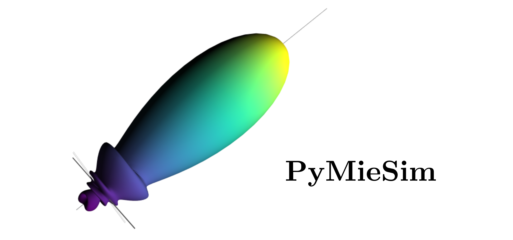

[](https://travis-ci.com/github/numpy/numpy)
[](https://codecov.io/gh/MartinPdeS/PyMieSim)


Welcome to PyMieSim's documentation!
====================================

PyMieSim is a very easy to install/use tool for extensive Mie scattering analysis. It allows to study the light scattering
on different kind of object, at the moment spherical scatterer and continous sample under the Born approximation.
Using this package, one can easily set a **LightSource** a **Scatterer** and a **Detector** within a very wide range of parameters such as:
<ol>
<li>LightSource wavelength</li>
<li>LightSource Polarization</li>
<li>Scatterer diameter</li>
<li>Scatterer refractive index</li>  
<li>Medium refractive index</li>  
<li>Detector type (photodiode or LPMode)</li>
<li>Detector numerical aperture</li>
<li>Detector angle offfset in polariation parallel axis (&phi;)</li>
<li>Detector angle offfset in polariation perpendicular axis (&theta;)</li>
<li>Detector coupling mode (Mean coupling or centered coupling)</li>
</ol>


The package also let you use a **ScattererSet** which define a range of scatterer diameter and a range of refractive index
in order to study how light scattered by such Set will be coupling in different situations.


Documentation
=============
For the moment, the documentation for the package is in the Docs/build/html/index.html file.
I invite you to open it, in order to checkout some pre-defined examples.


Google Colab
============
It's 2021, you don't need to run all codes on you computer anymore. Google Colab is a platform which allows to write/use python script remotely.
You can open the PyMieSim.ipynb in the file to access it.


dependencies
============
In order to install the package you first need to install some dependencies, which are the c++ boost library and some plotting library. To install one can use the command line such as:
```console
sudo apt-get install libproj-dev proj-data proj-bin    --> Plottings library
sudo apt-get install libgeos-dev                       --> Plottings library
sudo apt-get install libboost-all-dev                  --> Boost library
```

Installation
============
It's pretty simple:
```console
pip3 install -v git+https://github.com/MartinPdeS/PyMieSim.git
```


Running Unittest
================

To run the Unittests one need the coverage library.

```console
   python -m unittest Test/Unittest.py
```


Scattering Theory
=================
Light scattering depends on a few parameters:
<ol>
<li>Light field Wavelength</li>
<li>Light field Polarization</li>
<li>Light field structure</li>
<li>Scatterer geometry</li>  
<li>Medium refractive index</li>  
</ol>

Some useful relations:

Size Parameter: 

Scattering Matrix: 

For spherical Scatterers: 

[To be finished..]

To-Do List
----------

- Adding T-matrix formalism
- Addind cylindrical scatterer
- Adding docstring
- Adding Stokes parameter representations
- Adding more unittests
- Adding monotonic metric to optimizer class
- Comments on c++ codes
- verify if changes of NA for <LPmode> class can be simplified (it takes way too much time)
- adding travis and codecov [DONE]


Contact Information
===================
As of 2021 the project is still under development if you want to collaborate it would be a pleasure. I encourage you to contact me.

PyMieSim was written by [Martin Poinsinet de Sivry-Houle](https://github.com/MartinPdS).

Email: [martin.poinsinet-de-sivry@polymtl.ca](mailto:martin.poinsinet-de-sivry@polymtl.ca?subject=PyMieSim)
