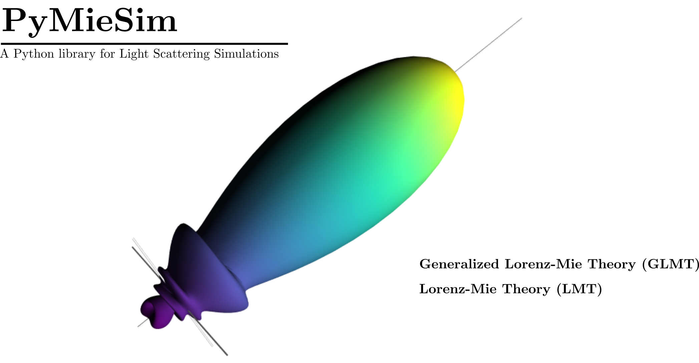

[](https://travis-ci.com/github/numpy/numpy)
[](https://codecov.io/gh/MartinPdeS/PyMieSim)
[](https://www.python.org/)
[](https://colab.research.google.com/drive/1FUi_hRUXxCVvkHBY10YE1yR-nTATcDei?usp=sharing)
[](https://pymiesim.readthedocs.io/en/latest/?badge=latest)

[](https://doi.org/10.5281/zenodo.4556074)


----
Welcome to PyMieSim's documentation!
====================================


PyMieSim is a very easy to install/use tool for extensive Mie scattering analysis. It allows to study the light scattering
on different kind of object (scatterer), at the moment I only implemented spherical scatterers.
Using this package, one can easily set a **LightSource** a **Scatterer** and a **Detector** within a very wide range of parameters such as:
<ol>
<li>LightSource structure (e.g. plane wave or Gaussian focused)</li>
<li>LightSource wavelength</li>
<li>LightSource Polarization</li>
<li>Scatterer diameter</li>
<li>Scatterer refractive index</li>
<li>Medium refractive index</li>
<li>Detector type (photodiode or LPMode)</li>
<li>Detector numerical aperture</li>
<li>Detector angle offfset in polariation parallel axis (&phi;)</li>
<li>Detector angle offfset in polariation perpendicular axis (&theta;)</li>
<li>Detector coupling mode (Mean coupling or centered coupling)</li>
</ol>


The package also let you use a **ScattererSet** which define a range of scatterer diameter and a range of refractive index
in order to study how light scattered by such Set will be coupling in different situations.


----
Documentation
=============
All the latest available documentation is available here https://pymiesim.readthedocs.io/en/latest/ or you can click the following badge:

[](https://pymiesim.readthedocs.io/en/latest/?badge=latest)


----
Google Colab
============
It's 2021, you don't need to run all codes on you computer anymore. Google Colab is a platform which allows to write/use python script remotely.
You can open the PyMieSim.ipynb in the file (or click on the "Open in Colab" badge) to access it or click on the following badge:

[](https://colab.research.google.com/drive/1FUi_hRUXxCVvkHBY10YE1yR-nTATcDei?usp=sharing)

----
Dependencies
============
In order to install the package you first need to install some dependencies, which are the c++ [boost library](https://boost.org) and some plotting library. To install one can use the command line such as:

**Linux (Debian)**
```console
sudo apt-get install libboost-all-dev
```

**MacOs**
```console
brew install boost
```


**Windows**

[Boost installation guide](https://www.boost.org/doc/libs/1_62_0/more/getting_started/windows.html)


----
Installation
============
It's pretty simple:
```console
pip install PyMieSim
```

----
Running Unittest
================

To run the Unit-tests one need the coverage library.

```console
   python -m unittest tests/Unittest.py
```


----
Usage
=====
Here is an example on how to use the library.
```console
from PyMieSim.Source import PlaneWave
from PyMieSim.Detector import LPmode
from PyMieSim.Scatterer import Sphere

LightSource = PlaneWave(Wavelength   = 450e-9,
                        Polarization = 0,
                        E0           = 1)

Detector = LPmode(Mode         = (0, 1,'h'),
                  Sampling     = 201,
                  NA           = 0.2,
                  GammaOffset  = 0,
                  PhiOffset    = 0,
                  CouplingMode = 'Centered')


Scat = Sphere(Diameter    = 300e-9,
              Source      = LightSource,
              Index       = 1.4)

Coupling = Detector.Coupling(Scatterer = Scat)

print(Coupling) # output: 1.66e+02 nWatt
```
For more examples I invite you to check the [examples](https://pymiesim.readthedocs.io/en/latest/Examples.html)
section of the documentations.


----
To-Do List
----------

- Adding T-matrix formalism
- Addind cylindrical scatterer
- Adding docstring
- Adding Stokes parameter representations
- Adding more unittests
- Adding monotonic metric to optimizer class
- Comments on c++ codes
- verify if changes of NA for <LPmode> class can be simplified (it takes way too much time)
- adding travis and codecov [DONE]


----
Citing this work?
================

[](https://doi.org/10.5281/zenodo.4556074)


----
Contact Information
===================
As of 2021 the project is still under development if you want to collaborate it would be a pleasure. I encourage you to contact me.

PyMieSim was written by [Martin Poinsinet de Sivry-Houle](https://github.com/MartinPdS).

Email: [martin.poinsinet-de-sivry@polymtl.ca](mailto:martin.poinsinet-de-sivry@polymtl.ca?subject=PyMieSim)
