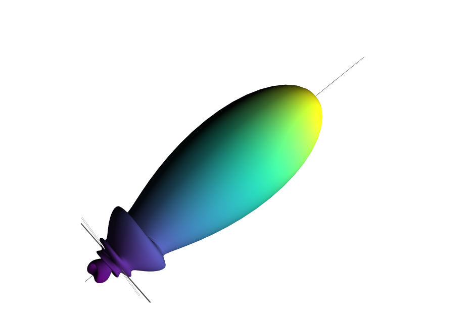

|codecov|
|travis|
|python|
|zenodo|
|colab|
|docs|

PyMieSim
========

PyMieSim is a very easy to install/use tool for extensive Mie scattering analysis. It allows to study the light scattering
on different kind of objects (scatterer) though at the moment, only spherical scatterers are implemented.
Using this package, one can easily set a **Source** a **Scatterer** and a **Detector** within a very wide range of parameters such as:

1. **Source** structure (e.g. plane wave or Gaussian focused)
2. **Source** wavelength
3. **Source** polarization
4. **Scatterer** diameter
5. **Scatterer** refractive index
6. **Medium** refractive index
7. **Detector** type (photodiode or LPMode)
8. **Detector** numerical aperture
9. **Detector** angle offset in polarization parallel axis (:math:`\phi`)
10. **Detector** angle offset in polarization perpendicular axis (:math:`\theta`)
11. **Detector** coupling mode (Mean coupling or centered coupling)

The package also lets you construct an **Experiment** using **ScattererSet**, **SourceSet** and **DetectorSet**.
Those class define the type of scatterers, light sources and detectors you want to study.

----

Documentation
**************
All the latest available documentation is available `here <https://pymiesim.readthedocs.io/en/latest/>`_ or you can click the following badge:

|docs|

----

Google Colab
**************
It's 2021, you don't need to run all your code on you computer anymore. Google Colab is a platform which allows to write/use python scripts remotely.
You can open the PyMieSim.ipynb in the file to access it or click on the following "Open in Colab" badge:

|colab|

----

Installation
************
Wheel support now extended to `manylinux2014 <https://www.python.org/dev/peps/pep-0599/>`_

It's pretty simple:

.. code-block:: python

   pip install PyMieSim

----

Running Unittest
*****************
To run the Unit-tests, one need the coverage library.

.. code-block:: python

   python -m unittest tests/Unittest.py

----

Usage
******
Here is an example on how to use the library.

.. code-block:: python

  from PyMieSim.Source import PlaneWave
  from PyMieSim.Detector import LPmode
  from PyMieSim.Scatterer import Sphere

  Source = PlaneWave(Wavelength   = 450e-9,
                     Polarization = 0,
                     E0           = 1)

  Detector = LPmode(Mode         = (0, 1),
                    Rotation     = 0.,
                    Sampling     = 201,
                    NA           = 0.2,
                    GammaOffset  = 0,
                    PhiOffset    = 0,
                    CouplingMode = 'Centered')

  Scat = Sphere(Diameter    = 300e-9,
                Source      = Source,
                Index       = 1.4)

  Coupling = Detector.Coupling(Scatterer = Scat)

  print(Coupling) # output: 1.66e+02 nWatt

For more examples, I invite you to check the `examples <https://pymiesim.readthedocs.io/en/latest/Examples.html>`_
section of the documentation.

Coding examples
***************

A large set of examples are avaialble in the `test/Examples` folder. You can also see them in the examples section of the `documentation <https://pymiesim.readthedocs.io/en/latest/>`_

----

To-Do List
**********
- Adding dumb-proof assertions
- Adding docstring
- Adding Stokes parameter representations [DONE]
- Multiprocess Experiment class
- Adding more unittests
- Adding monotonic metric to optimizer class [DONE]
- Comments on c++ codes
- Multiclass c++ codes
- verify if changes of NA for <LPmode> class can be simplified [DONE]
- adding travis and codecov [DONE]
- adding material Sellmeier boundary

----

Citing this work?
******************
I spent half a year to develop this tool for you to use so if it helped you in your research, I would greatly appreciate
that you cite my work. Many thanks!
|zenodo|

(Is this the new "like, comment and share" ?)

----

Developper mode
****************
In order to compile the project without using pip, a few depedencies are to be installed.
Those are the C++ boost library and a C++/Fortran wrapper for bessel function with complex argument (nowhere to be found as C++ lib).

I have worked out a Dockerfile (see the `PyMieSim Git <https://github.com/MartinPdeS/PyMieSim>`_) to install all the necessaries library.

I you prefer to directly install in your computer the files you can do the following

**Boost library**

Linux (Debian)
--------------

.. code-block:: python

   sudo apt-get install libboost-all-dev

MacOs
-----

.. code-block:: python

   brew install boost

Windows
-------
`Boost installation guide <https://www.boost.org/doc/libs/1_62_0/more/getting_started/windows.html>`_

**Fortran wrapper**

You have to compile and install the code yourself. Follow the instruction as showed `here <https://github.com/joeydumont/complex_bessel>`_ .

Contact Information
************************
As of 2021, the project is still under development. If you want to collaborate, it would be a pleasure! I encourage you to contact me.

PyMieSim was written by `Martin Poinsinet de Sivry-Houle <https://github.com/MartinPdS>`_  .

Email:`martin.poinsinet-de-sivry@polymtl.ca <mailto:martin.poinsinet-de-sivry@polymtl.ca?subject=PyMieSim>`_ .

.. |codecov| image:: https://codecov.io/gh/MartinPdeS/PyMieSim/branch/master/graph/badge.svg
   :target: https://codecov.io/gh/MartinPdeS/PyMieSim

.. |travis| image:: https://img.shields.io/travis/com/MartinPdeS/PyMieSim/master?label=Travis%20CI
   :target: https://travis-ci.com/github/numpy/numpy

.. |python| image:: https://img.shields.io/badge/Made%20with-Python-1f425f.svg
   :target: https://www.python.org/

.. |zenodo| image:: https://zenodo.org/badge/DOI/10.5281/zenodo.4556074.svg
   :target: https://doi.org/10.5281/zenodo.4556074

.. |colab| image:: https://colab.research.google.com/assets/colab-badge.svg
   :target: https://colab.research.google.com/drive/1FUi_hRUXxCVvkHBY10YE1yR-nTATcDei?usp=sharing

.. |docs| image:: https://readthedocs.org/projects/pymiesim/badge/?version=latest
   :target: https://pymiesim.readthedocs.io/en/latest/?badge=latest
