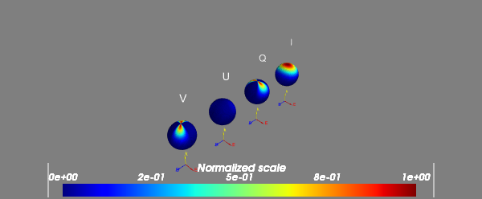
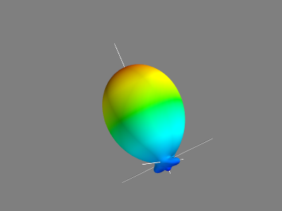
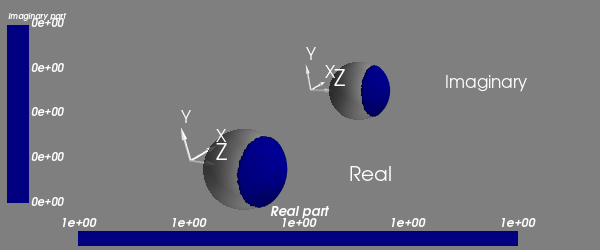
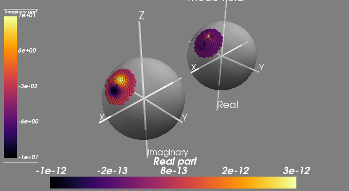
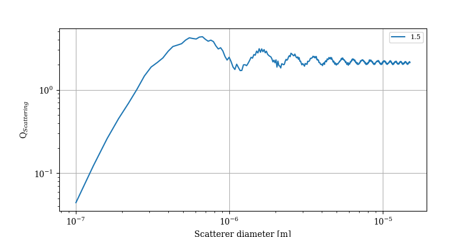
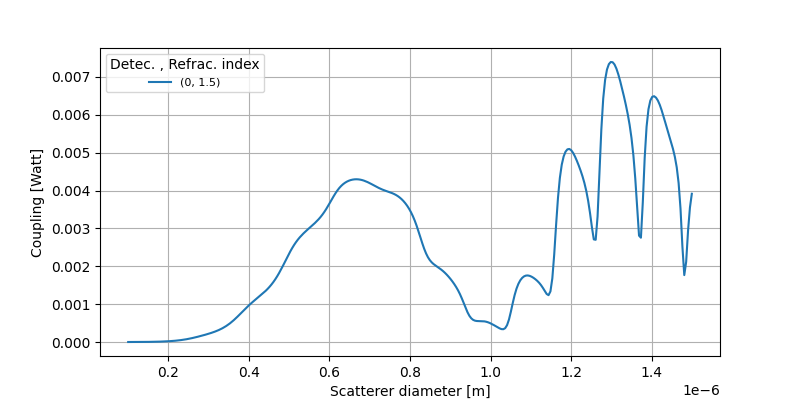

Examples
========

-----

Scatterer: S1-S2
----------------

.. code-block:: python
   :linenos:

   from PyMieSim.Scatterer import Sphere
   from PyMieSim.Source import PlaneWave

   Source = PlaneWave(Wavelength   = 450e-9,
                      Polarization = 0,
                      E0           = 1)

   Scat = Sphere(Diameter    = 300e-9,
                 Source      = Source,
                 Index       = 1.4)

   S1S2 = Scat.S1S2(Num=100)

   S1S2.Plot()

.. image:: ../images/S1S2.png
   :width: 600

-----

Scatterer: Stokes
-----------------

.. code-block:: python
   :linenos:

   from PyMieSim.Scatterer import Sphere
   from PyMieSim.Source import PlaneWave

   Source = PlaneWave(Wavelength   = 450e-9,
                      Polarization = 0,
                      E0           = 1)

   Scat = Sphere(Diameter    = 300e-9,
                 Source      = Source,
                 Index       = 1.4)

   Stokes = Scat.Stokes(Num=100)

   Stokes.Plot()

-----

Scatterer: full far-field
-------------------------

.. code-block:: python
   :linenos:

   from PyMieSim.Scatterer import Sphere
   from PyMieSim.Source import PlaneWave

   Source = PlaneWave(Wavelength   = 450e-9,
                      Polarization = 0,
                      E0           = 1)

   Scat = Sphere(Diameter    = 300e-9,
                 Source      = Source,
                 Index       = 1.4)

   Fields = Scat.FarField(Num=100)

   Fields.Plot()

.. image:: ../images/Fields.png
   :width: 600

-----

Scatterer: phase function
-------------------------

.. code-block:: python
   :linenos:

   from PyMieSim.Scatterer import Sphere
   from PyMieSim.Source import PlaneWave

   Source = PlaneWave(Wavelength   = 450e-9,
                      Polarization = 0,
                      E0           = 1)

   Scat = Sphere(Diameter    = 800e-9,
                Source      = Source,
                Index       = 1.4)

   SPF = Scat.SPF(Num=100)

   SPF.Plot()

-----

Detector: Photodiode
--------------------

.. code-block:: python
   :linenos:

   from PyMieSim.Source import PlaneWave
   from PyMieSim.Detector import Photodiode

   Source = PlaneWave(Wavelength   = 450e-9,
                      Polarization = 0,
                      E0           = 1)

   Detector = Photodiode(NA                = 0.8,
                         Sampling          = 1001,
                         GammaOffset       = 0,
                         PhiOffset         = 0)

   Detector.Plot()

-----

Detector: LPMode
----------------

.. code-block:: python
   :linenos:

   from PyMieSim.Source import PlaneWave
   from PyMieSim.Detector import LPmode

   Source = PlaneWave(Wavelength   = 450e-9,
                      Polarization = 0,
                      E0           = 0)

   Detector = LPmode(Mode         = (1, 1),
                     Rotation     = 0.,
                     Sampling     = 201,
                     NA           = 0.4,
                     GammaOffset  = 0,
                     PhiOffset    = 40,
                     CouplingMode = 'Centered')

   Detector.Plot()

-----

Coupling: Scatterer-Photodiode
------------------------------

.. code-block:: python
   :linenos:

   from PyMieSim.Source import PlaneWave
   from PyMieSim.Detector import Photodiode
   from PyMieSim.Scatterer import Sphere

   Source = PlaneWave(Wavelength   = 450e-9,
                      Polarization = 0,
                      E0           = 1)

   Detector = Photodiode(Sampling     = 201,
                         NA           = 0.2,
                         GammaOffset  = 0,
                         PhiOffset    = 0,
                         CouplingMode = 'Centered')

   Scat = Sphere(Diameter    = 300e-9,
                 Source      = Source,
                 Index       = 1.4)

   Coupling = Detector.Coupling(Scatterer = Scat)

   print(Coupling)

Output: (6.57e+01 nWatt)

-----

ScattererSet: Qscattering
--------------------------

.. code-block:: python
   :linenos:

   import numpy as np
   from PyMieSim.Source import PlaneWave
   from PyMieSim.Sets import ScattererSet

   Source = PlaneWave(Wavelength   = 450e-9,
                      Polarization = 0,
                      E0           = 1)

   ScatSet = ScattererSet(DiameterList  = np.linspace(100e-9, 10000e-9, 400),
                          IndexList        = np.linspace(1.5, 1.8, 3).round(1),
                          Source        = Source)

   Qsca = ScatSet.Qsca()

   fig = Qsca.Plot()

-----

Experiment: Qsca vs. diameter
------------------------------

.. code-block:: python
   :linenos:

   from PyMieSim.Scatterer import Sphere
   from PyMieSim.Detector import Photodiode
   from PyMieSim.Experiment import ScatSet, SourceSet, Setup
   import numpy as np

   DiameterList   = np.linspace(400e-9, 1000e-9, 200)

   Detector0 = Photodiode(NA                = 0.1,
                         Sampling          = 300,
                         GammaOffset       = 20,
                         PhiOffset         = 30,
                         CouplingMode      = 'Centered')

   scat = ScatSet(DiameterList  = DiameterList,
                  IndexList         = [1.5],
                  nMedium        = 1,
                  ScattererType  = 'Sphere')

   source = SourceSet(WavelengthList   = 400e-9,
                     PolarizationList  = [0],
                     SourceType        = 'PlaneWave')

   Experiment = Setup(ScattererSet = scat,
                      SourceSet    = source,
                      DetectorSet  = [Detector0])

   Qsca = Experiment.Qsca(AsType='dataframe')

   Qsca.Plot(y='Qsca', x='Diameter')

.. image:: ../images/QscaVSDiameter.png
  :width: 600

-----

Experiment: Qsca vs. wavelength
-------------------------------

.. code-block:: python
   :linenos:

   from PyMieSim.Scatterer import Sphere
   from PyMieSim.Detector import Photodiode
   from PyMieSim.Experiment import ScatSet, SourceSet, Setup
   import numpy as np

   WavelengthList   = np.linspace(400e-9, 1000e-9, 200)

   Detector0 = Photodiode(NA               = 0.1,
                         Sampling          = 300,
                         GammaOffset       = 20,
                         PhiOffset         = 30,
                         CouplingMode      = 'Centered')

   scat = ScatSet(DiameterList   = 200e-9,
                  IndexList         = [1.5],
                  nMedium        = 1,
                  ScattererType  = 'Sphere')

   source = SourceSet(WavelengthList   = WavelengthList,
                     PolarizationList  = [0],
                     SourceType        = 'PlaneWave')

   Experiment = Setup(ScattererSet = scat,
                      SourceSet    = source,
                      DetectorSet  = [Detector0])

   Qsca = Experiment.Qsca(AsType='dataframe')

   Qsca.Plot(y='Qsca', x='Wavelength')

.. image:: ../images/QscaVSWavelength.png
  :width: 600

-----

Experiment: Coupling vs. diameter
---------------------------------

.. code-block:: python
   :linenos:

   from PyMieSim.Scatterer import Sphere
   from PyMieSim.Detector import Photodiode
   from PyMieSim.Experiment import ScatSet, SourceSet, Setup
   import numpy as np

   DiameterList   = np.linspace(400e-9, 1000e-9, 200)

   Detector0 = Photodiode(NA                = 0.1,
                          Sampling          = 300,
                          GammaOffset       = 20,
                          PhiOffset         = 30,
                          CouplingMode      = 'Centered')

   scat = ScatSet(DiameterList  = DiameterList,
                  IndexList         = [1.5],
                  nMedium        = 1,
                  ScattererType  = 'Sphere')

   source = SourceSet(WavelengthList   = 400e-9,
                      PolarizationList = [0],
                      SourceType       = 'PlaneWave')

   Experiment = Setup(ScattererSet = scat,
                      SourceSet    = source,
                      DetectorSet  = [Detector0])

   DF = Experiment.Coupling(AsType='dataframe')

   DF.Plot(y='Coupling', x='Diameter')

.. image:: ../images/CouplingVSDiameter.png
  :width: 600

-----

Experiment: Coupling vs. wavelength
---------------------------------

.. code-block:: python
  :linenos:

  from PyMieSim.Scatterer import Sphere
  from PyMieSim.Detector import Photodiode
  from PyMieSim.Experiment import ScatSet, SourceSet, Setup
  import numpy as np

  WavelengthList = np.linspace(400e-9, 1000e-9, 100)

  Detector0 = Photodiode(NA                = 2.0,
                         Sampling          = 300,
                         GammaOffset       = 0,
                         PhiOffset         = 0,
                         CouplingMode      = 'Centered')

  scat = ScatSet(DiameterList  = [200e-9],
                 IndexList        = [4],
                 nMedium       = 1,
                 ScattererType = 'Sphere')

  source = SourceSet(WavelengthList   = WavelengthList,
                     PolarizationList = [0],
                     SourceType       = 'PlaneWave')

  Experiment = Setup(ScattererSet = scat,
                     SourceSet    = source,
                     DetectorSet  = [Detector0])

  DF = Experiment.Coupling(AsType='dataframe')

  DF.Plot(y='Coupling', x='Wavelength')

.. image:: ../images/CouplingVSWavelength.png
   :width: 600

-----

Optimization: 1 parameter
-------------------------

.. code-block:: python
  :linenos:

  import numpy as np
  from PyMieSim.Detector import Photodiode, LPmode
  from PyMieSim.Source import PlaneWave
  from PyMieSim.Optimization import Optimizer
  from PyMieSim.Experiment import ScatSet, SourceSet, Setup

  DiameterList   = np.linspace(100e-9, 1000e-9, 200)

  Detector0 = Photodiode(NA                 = 0.1,
                         Sampling          = 300,
                         GammaOffset       = 20,
                         PhiOffset         = 0,
                         CouplingMode      = 'Centered')

  scat = ScatSet(DiameterList   = DiameterList,
                 IndexList      = [1.5],
                 nMedium        = 1,
                 ScattererType  = 'Sphere')

  source = SourceSet(WavelengthList  = 400e-9,
                     PolarizationList  = [0],
                     SourceType        = 'PlaneWave')

  Experiment = Setup(ScattererSet = scat,
                     SourceSet    = source,
                     DetectorSet  = [Detector0])

  # Metric can be "max" - "min" - "mean"
  #"std+RI" - "std+Diameter" - "std+Polarization" - "std+Wavelength" - "std+Detector"
  #"monotonic+RI" - "monotonic+Diameter" - "monotonic+Polarization" - "monotonic+Wavelength" - "monotonic+Detector"

  Opt    = Optimizer(Setup           = Experiment,
                     Metric          = 'mean',
                     Parameter       = ['PhiOffset'],
                     Optimum         = 'Maximum',
                     MinVal          = [1e-5],
                     MaxVal          = [180],
                     WhichDetector   = 0,
                     X0              = [0.6],
                     MaxIter         = 350,
                     Tol             = 1e-4,
                     FirstStride     = 30)

  print(Opt.Result)

  df = Experiment.Coupling(AsType='dataframe')

  df.Plot(y='Coupling', x='Diameter') # can be "Couplimg"  or  "STD"

**Output:**

| Call Number : 1             	 PhiOffset: 1.00000e-01             	 Result: -7.3947105131e-03
| Call Number : 2             	 PhiOffset: 1.01000e+01             	 Result: -4.5216666010e-03
| Call Number : 3             	 PhiOffset: -9.90000e+00             	 Result: -4.6103038869e-03
| Call Number : 4             	 PhiOffset: -4.90000e+00             	 Result: -6.5239220916e-03
| Call Number : 5             	 PhiOffset: 2.60000e+00             	 Result: -7.1347913938e-03
| Call Number : 6             	 PhiOffset: -1.15000e+00             	 Result: -7.3444635289e-03
| Call Number : 7             	 PhiOffset: 7.25000e-01             	 Result: -7.3742571154e-03
| Call Number : 8             	 PhiOffset: -2.12500e-01             	 Result: -7.3935287699e-03
| Call Number : 9             	 PhiOffset: 2.56250e-01             	 Result: -7.3924460072e-03
| Call Number : 10             	 PhiOffset: 2.18750e-02             	 Result: -7.3951290146e-03
| Call Number : 11             	 PhiOffset: -5.62500e-02             	 Result: -7.3950715369e-03
| Call Number : 12             	 PhiOffset: -1.71875e-02             	 Result: -7.3951597748e-03
| Call Number : 13             	 PhiOffset: -5.62500e-02             	 Result: -7.3950715369e-03
| Call Number : 14             	 PhiOffset: -3.67188e-02             	 Result: -7.3951305305e-03
| Call Number : 15             	 PhiOffset: -7.42188e-03             	 Result: -7.3951632409e-03
| Call Number : 16             	 PhiOffset: 2.34375e-03             	 Result: -7.3951592695e-03
| Call Number : 17             	 PhiOffset: -2.53906e-03             	 Result: -7.3951621849e-03
| Call Number : 18             	 PhiOffset: -9.86328e-03             	 Result: -7.3951630716e-03
| Call Number : 19             	 PhiOffset: -6.20117e-03             	 Result: -7.3951631512e-03
| Call Number : 20             	 PhiOffset: -8.03223e-03             	 Result: -7.3951632421e-03
| Call Number : 21             	 PhiOffset: -8.33740e-03             	 Result: -7.3951632319e-03
| Call Number : 22             	 PhiOffset: -7.87964e-03             	 Result: -7.3951632446e-03
| Call Number : 23             	 PhiOffset: -7.72705e-03             	 Result: -7.3951632451e-03
| Call Number : 24             	 PhiOffset: -7.57446e-03             	 Result: -7.3951632439e-03
| Call Number : 25             	 PhiOffset: -7.82705e-03             	 Result: -7.3951632450e-03
| fun: -0.007395163244966126
| maxcv: 0.0
| message: 'Optimization terminated successfully.'
| nfev: 25
| status: 1
| success: True
| x: array([-0.00782705])

-----

Optimization: 2 parameters
--------------------------

.. code-block:: python
  :linenos:

  import numpy as np
  from PyMieSim.Detector import Photodiode, LPmode
  from PyMieSim.Source import PlaneWave
  from PyMieSim.Optimizer import Optimize
  from PyMieSim.Sets import ExperimentalSet, ScattererSet

  Source = PlaneWave(Wavelength   = 450e-9,
                     Polarization = 0,
                     E0           = 1e5)

  Detector0 = Photodiode(NA               = 0.1,
                        Sampling          = 300,
                        GammaOffset       = 20,
                        PhiOffset         = 0,
                        CouplingMode      = 'Centered')

  Detector1 = Photodiode(NA                = 0.1,
                         Sampling          = 300,
                         GammaOffset       = 30,
                         PhiOffset         = 0,
                         CouplingMode      = 'Centered')

  ScatSet = ScattererSet(DiameterList  = np.linspace(100e-9, 1500e-9, 300),
                         IndexList        = np.linspace(1.5, 1.8, 1).round(1),
                         Source        = Source)

  Set = ExperimentalSet(ScattererSet = ScatSet, Detectors = (Detector0))

  Opt    = Optimize(ExperimentalSet = Set,
                    Metric          = 'Monotonic',
                    Parameter       = ['NA','PhiOffset'],
                    MinVal          = [1e-1, None],
                    MaxVal          = [1, None],
                    WhichDetector   = 0,
                    X0              = [0.1,30],
                    MaxIter         = 350,
                    Tol             = 1e-4,
                    FirstStride     = 30)

  print(Opt.Result)

  df = Set.DataFrame

  df.Plot('Coupling') # can be "Couplimg"  or  "STD"

LP-modes: Generate files
------------------------

I have prealably compilated 12 LP-modes which are:

1. LP01
2. LP11
3. LP21
4. LP02
5. LP31
6. LP12
7. LP41
8. LP22
9. LP03
10. LP51
11. LP32
12. LP13

So you can already use them, no need to reproduce. However if you want to
use another mode you first need to install the fibermodes package using the
following command:

.. code-block:: python
  :linenos:

  pip install https://github.com/cbrunet/fibermodes.git

Then you can use the PyMieSIm FiberModes module as follow:

.. code-block:: python
  :linenos:

  from PyMieSim.FiberModes import Genfiles

  Genfiles([(5,2)], padWidth = 2000, Num = 251)
