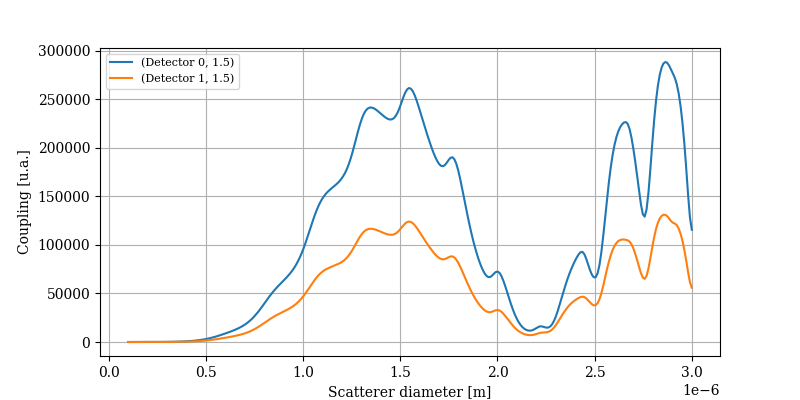

Examples
========

Scatterer: S1-S2
----------------

.. code-block:: console
   :linenos:

   from PyMieSim.Scatterer import Sphere
   from PyMieSim.Source import PlaneWave

   LightSource = PlaneWave(Wavelength = 450e-9,
                           Polarization = 0)

   Scat = Sphere(Diameter    = 300e-9,
                 Source      = LightSource,
                 Index       = 1.4)

   S1S2 = Scat.S1S2(Num=100)

   S1S2.Plot()

.. image:: ../images/S1S2.png
   :width: 600

Scatterer: full far-field
-------------------------

.. code-block:: console
   :linenos:

   from PyMieSim.Scatterer import Sphere
   from PyMieSim.Source import PlaneWave

   LightSource = PlaneWave(Wavelength = 450e-9,
                           Polarization = 0)

   Scat = Sphere(Diameter    = 300e-9,
                 Source      = LightSource,
                 Index       = 1.4)

   Fields = Scat.FarField(Num=100)

   Fields.Plot()

.. image:: ../images/Fields.png
   :width: 600

Scatterer: phase function
-------------------------

.. code-block:: console
   :linenos:

   from PyMieSim.Scatterer import Sphere
   from PyMieSim.Source import PlaneWave

   LightSource = PlaneWave(Wavelength = 450e-9,
                          Polarization = 0)

   Scat = Sphere(Diameter    = 800e-9,
                Source      = LightSource,
                Index       = 1.4)

   SPF = Scat.SPF(Num=100)

   SPF.Plot()

.. image:: ../images/SPF.png
   :width: 600

Detector: Photodiode
--------------------

.. code-block:: console
   :linenos:

   from PyMieSim.Source import PlaneWave
   from PyMieSim.Detector import Photodiode

   Source = PlaneWave(Wavelength   = 450e-9,
                      Polarization = 0,
                      E0           = 1.)

   Detector = Photodiode(NA                = 0.8,
                         Sampling          = 1001,
                         GammaOffset       = 0,
                         PhiOffset         = 0)

   Detector.Plot()

.. image:: ../images/Photodiode.png
   :width: 600

Detector: LPMode
----------------

.. code-block:: console
   :linenos:

   from PyMieSim.Source import PlaneWave
   from PyMieSim.Detector import LPmode

   Source = PlaneWave(Wavelength   = 450e-9,
                      Polarization = 0,
                      E0           = 0)

   Detector = LPmode(Mode         = (1, 1,'h'),
                     Sampling     = 201,
                     NA           = 0.4,
                     GammaOffset  = 0,
                     PhiOffset    = 40,
                     CouplingMode = 'Centered')

   Detector.Plot()

.. image:: ../images/LPmode.png
   :width: 600

Coupling: Scatterer-Photodiode
------------------------------

.. code-block:: console
   :linenos:

   from PyMieSim.Source import PlaneWave
   from PyMieSim.Detector import Photodiode
   from PyMieSim.Scatterer import Sphere

   LightSource = PlaneWave(Wavelength = 450e-9,
                           Polarization = 0,
                           E0= 1e5)

   Detector = Photodiode(Sampling     = 201,
                         NA           = 0.2,
                         GammaOffset  = 0,
                         PhiOffset    = 0,
                         CouplingMode = 'Centered')

   Scat = Sphere(Diameter    = 300e-9,
                 Source      = LightSource,
                 Index       = 1.4)

   Coupling = Detector.Coupling(Scatterer = Scat)

   print(Coupling)

Output: (6.57e+01 nWatt)

ScattererSet: Qscattering
--------------------------

.. code-block:: console
   :linenos:

   import numpy as np
   from PyMieSim.Source import PlaneWave
   from PyMieSim.Sets import ScattererSet

   LightSource = PlaneWave(Wavelength = 450e-9,
                          Polarization = 0)

   ScatSet = ScattererSet(DiameterList  = np.linspace(100e-9, 10000e-9, 400),
                          RIList        = np.linspace(1.5, 1.8, 3).round(1),
                          Source        = LightSource)

   Qsca = ScatSet.Qsca()

   fig = Qsca.Plot()

.. image:: ../images/Qsca.png
   :width: 600

ExperimentalSet: Coupling
----------------------------

.. code-block:: console
   :linenos:

   import numpy as np
   from PyMieSim.Source import PlaneWave
   from PyMieSim.Detector import LPmode
   from PyMieSim.Sets import ScattererSet, ExperimentalSet

   LightSource = PlaneWave(Wavelength   = 450e-9,
                           Polarization = 0,
                           E0           = 1)

   Detector0 = LPmode(NA               = 0.2,
                      Sampling          = 401,
                      GammaOffset       = 0,
                      PhiOffset         = 20,
                      Mode              = (0,1),
                      CouplingMode      = 'Mean')

   Detector1 = LPmode(NA               = 0.2,
                      Sampling          = 401,
                      GammaOffset       = 0,
                      PhiOffset         = 20,
                      Mode              = (1,1),
                      CouplingMode      = 'Mean')

   ScatSet = ScattererSet(DiameterList  = np.linspace(100e-9, 1500e-9, 500),
                          RIList        = np.linspace(1.5, 1.5, 1).round(1),
                          Source        = LightSource)

   Set = ExperimentalSet(ScattererSet  = ScatSet,
                         Detectors     = (Detector0, Detector1))

   Data = Set.DataFrame

   Data.Plot(y='Coupling')

Optimizer: 1 parameter
----------------------

.. code-block:: console
 :linenos:

 import numpy as np
 from PyMieSim.Detector import Photodiode, LPmode
 from PyMieSim.Source import PlaneWave
 from PyMieSim.Optimizer import Optimize
 from PyMieSim.Sets import ExperimentalSet, ScattererSet

 LightSource = PlaneWave(Wavelength   = 450e-9,
                         Polarization = 0,
                         E0           = 1e7)

 Detector0 = Photodiode(NA               = 0.1,
                       Sampling          = 300,
                       GammaOffset       = 20,
                       PhiOffset         = 0,
                       CouplingMode      = 'Centered')

 Detector1 = Photodiode(NA                = 0.1,
                        Sampling          = 300,
                        GammaOffset       = 30,
                        PhiOffset         = 0,
                        CouplingMode      = 'Centered')

 ScatSet = ScattererSet(DiameterList  = np.linspace(100e-9, 1500e-9, 300),
                        RIList        = np.linspace(1.5, 1.8, 1).round(1),
                        Source        = LightSource)

 Set = ExperimentalSet(ScattererSet = ScatSet, Detectors = (Detector0))

 Opt    = Optimize(ExperimentalSet = Set,
                   Metric          = 'Max',  # can be 'Max", "Min", "RI_RSD", "Size_RSD", "Monotonic"
                   Parameter       = ['NA'],
                   MinVal          = [1e-1],
                   MaxVal          = [1],
                   WhichDetector   = 0,
                   X0              = [0.1],
                   MaxIter         = 350,
                   Tol             = 1e-4,
                   FirstStride     = 30)

 print(Opt.Result)

 df = Set.DataFrame

 df.Plot('Coupling') # can be "Couplimg"  or  "STD"

Optimizer: 2 parameters
-----------------------

.. code-block:: console
  :linenos:

  import numpy as np
  from PyMieSim.Detector import Photodiode, LPmode
  from PyMieSim.Source import PlaneWave
  from PyMieSim.Optimizer import Optimize
  from PyMieSim.Sets import ExperimentalSet, ScattererSet

  LightSource = PlaneWave(Wavelength   = 450e-9,
                          Polarization = 0,
                          E0           = 1e7)

  Detector0 = Photodiode(NA               = 0.1,
                        Sampling          = 300,
                        GammaOffset       = 20,
                        PhiOffset         = 0,
                        CouplingMode      = 'Centered')

  Detector1 = Photodiode(NA                = 0.1,
                         Sampling          = 300,
                         GammaOffset       = 30,
                         PhiOffset         = 0,
                         CouplingMode      = 'Centered')

  ScatSet = ScattererSet(DiameterList  = np.linspace(100e-9, 1500e-9, 300),
                         RIList        = np.linspace(1.5, 1.8, 1).round(1),
                         Source        = LightSource)

  Set = ExperimentalSet(ScattererSet = ScatSet, Detectors = (Detector0))

  Opt    = Optimize(ExperimentalSet = Set,
                    Metric          = 'Monotonic',  # can be 'Max", "Min", "RI_RSD", "Size_RSD", "Monotonic"
                    Parameter       = ['NA','PhiOffset'],
                    MinVal          = [1e-1, None],
                    MaxVal          = [1, None],
                    WhichDetector   = 0,
                    X0              = [0.1,30],
                    MaxIter         = 350,
                    Tol             = 1e-4,
                    FirstStride     = 30)

  print(Opt.Result)

  df = Set.DataFrame

  df.Plot('Coupling') # can be "Couplimg"  or  "STD"
