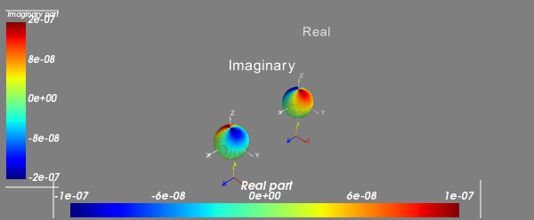
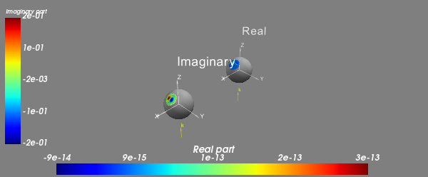
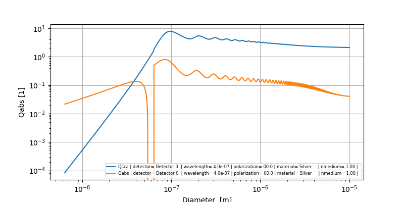
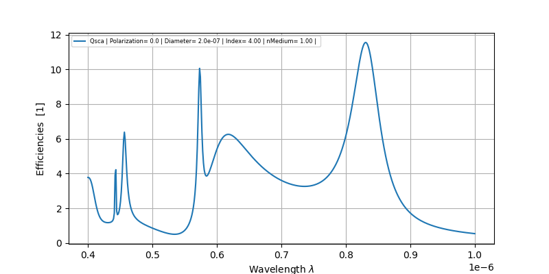
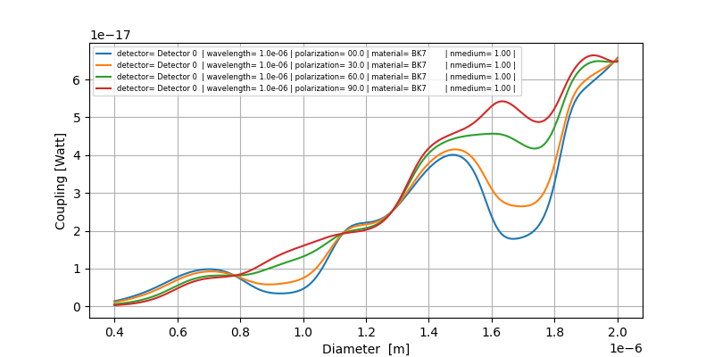
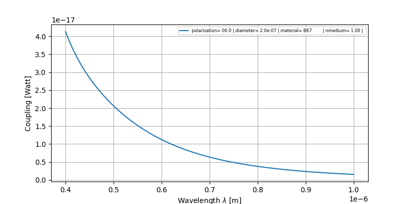

Examples
========

.. literalinclude:: ../../examples/Index.py
    :language: python
    :caption: **Scatterer: Index**
    :lines: 0-
    :linenos:

-------------------

.. literalinclude:: ../../examples/Material.py
    :language: python
    :caption: **Scatterer: Material**
    :lines: 0-
    :linenos:

-------------------------

.. literalinclude:: ../../examples/ScatProperties.py
    :language: python
    :caption: **Scatterer: ScatProperties**
    :lines: 0-
    :linenos:

----------------

.. literalinclude:: ../../examples/S1S2.py
    :language: python
    :linenos:
    :caption: **Scatterer: S1-S2**
    :lines: 0-

.. image:: ../images/S1S2.png
   :width: 600

-----------------

.. literalinclude:: ../../examples/Stokes.py
    :language: python
    :caption: **Scatterer: Stokes**
    :lines: 0-
    :linenos:

.. image:: ../images/Stokes.png
   :width: 600

-------------------------

.. literalinclude:: ../../examples/FarField.py
    :language: python
    :caption: **Scatterer: full far-field**
    :lines: 0-
    :linenos:

-------------------------

.. literalinclude:: ../../examples/SPF.py
    :language: python
    :caption: **Scatterer: phase function**
    :lines: 0-
    :linenos:

.. image:: ../images/SPF.png
   :width: 600

--------------------

.. literalinclude:: ../../examples/Photodiode.py
    :language: python
    :caption: **Detector: Photodiode**
    :lines: 0-
    :linenos:

.. image:: ../images/Photodiode.png
   :width: 600

----------------

.. literalinclude:: ../../examples/LPMode.py
    :language: python
    :caption: **Detector: LPMode**
    :lines: 0-
    :linenos:

------------------------------

.. literalinclude:: ../../examples/Scatterer-Photodiode.py
    :language: python
    :caption: **Coupling: Scatterer-Photodiode**
    :lines: 0-
    :linenos:

Output: (6.57e+01 nWatt)

--------------------------

.. literalinclude:: ../../examples/Qscattering.py
    :language: python
    :caption: **ScattererSet: Qscattering**
    :lines: 0-
    :linenos:

.. image:: ../images/Qscattering.png
   :width: 600

------------------------------

.. literalinclude:: ../../examples/Qsca-vs-diameter.py
    :language: python
    :caption: **Experiment: Qsca-vs-diameter**
    :lines: 0-
    :linenos:

--------------------------

.. literalinclude:: ../../examples/Mie-resonances.py
    :language: python
    :caption: **Experiment: Mie-resonances**
    :lines: 0-
    :linenos:

---------------------------------

.. literalinclude:: ../../examples/Coupling-vs-diameter.py
    :language: python
    :caption: **Experiment: Coupling-vs-diameter**
    :lines: 0-
    :linenos:

-----------------------------------

.. literalinclude:: ../../examples/Coupling-vs-wavelength.py
    :language: python
    :caption: **Experiment: Coupling-vs-wavelength**
    :lines: 0-
    :linenos:

------------------------------

.. literalinclude:: ../../examples/Opt-1-parameter.py
    :language: python
    :caption: **Optimization: Opt-1-parameter**
    :lines: 0-
    :linenos:

..
  .. image:: ../images/Opt1Param.png
     :width: 600

------------------------------

.. literalinclude:: ../../examples/Opt-2-parameter.py
    :language: python
    :caption: **Optimization: Opt-2-parameter**
    :lines: 0-
    :linenos:
